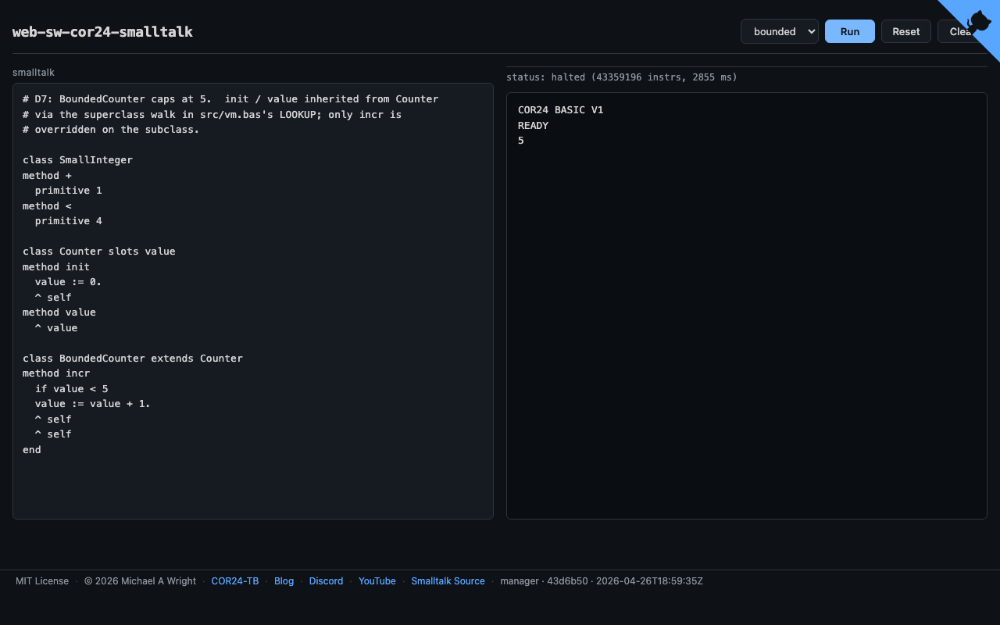

# web-sw-cor24-smalltalk

Browser-based live demo for the
[sw-cor24-smalltalk](https://github.com/sw-embed/sw-cor24-smalltalk)
project: a tiny integer-only "Tinytalk" hosted entirely in COR24 BASIC v1,
in the spirit of the ~1000-line BASIC-hosted Smalltalk evaluator that Alan
Kay's group built in 1972.

**Live demo**: https://sw-embed.github.io/web-sw-cor24-smalltalk/

Part of the [Software Wrighter COR24 Tools Project](https://sw-embed.github.io/web-sw-cor24-demos/#/).



## Intro

Three nested fetch/decode/execute loops are running at all times in your
browser:

```
Browser (WASM):
  pa24r p-code VM        <- runs the BASIC interpreter
  +- COR24 BASIC v1      <- runs vm.bas + image_dN.bas + dN_*.bas
     +- Tinytalk VM      <- src/vm.bas: dispatch, send, primitives
        +- Smalltalk image  <- class table, method dicts, bytecodes
```

Same architecture as the rest of the `web-sw-cor24-*` family
(`basic`, `pascal`, `snobol4`, `forth`, ...): one Yew SPA, one Trunk
build, one p-code VM in WebAssembly. No backend.

The point is not speed (it is slow). The point is to make the mental
model of object-oriented dispatch *visible*: every step the VM takes
runs through real `CLASSOF -> LOOKUP -> ACTIVATE -> primitive-or-frame-push`,
hand-coded as `GOSUB` chains in BASIC.

## Quickstart

```bash
# Run the dev server (port 9075, exclusive dist/ lock).
./scripts/serve.sh

# Open http://localhost:9075/
```

Pick a demo from the dropdown and hit **Run** (or Cmd/Ctrl-Enter).
**Esc** stops a running session. **Reset** reloads the demo source.
**Clear** wipes the output panel. For the interactive demo (`d5_calc`),
an input row appears below the output -- type a value and press Enter
(or click Send).

## Demos

Seven demos ship with the build, bundled at compile time from
`../sw-cor24-smalltalk/{src,examples}/` via `build.rs`:

| Demo | Result | Description |
| --- | --- | --- |
| `repl`      | varies  | Interactive integer calc REPL (default). Selectors: `1=+ 2=- 3=* 4=< 14=max:`; `0` quits. |
| `add`       | `7`     | `3 + 4` via `SmallInteger>>+` (primitive method). |
| `counter`   | `2`     | `Counter` class with one instance variable; user-defined `init` / `incr` / `value`; nested user->primitive sends. |
| `boolean`   | `42`    | `5 < 10 ifTrue: 42 ifFalse: 0` via True/False objects with their own polymorphic `ifTrue:ifFalse:`. No native `IF` makes the choice. |
| `max`       | `5`     | `5 max: 3` via `SmallInteger>>max:` whose bytecode uses `JUMP_IF_FALSE` for real conditional control flow inside a Smalltalk method. |
| `factorial` | `120`   | `5 fact` via *recursive* `SmallInteger>>fact`. First proof that the v0 frame stack handles non-trivial nesting. |
| `bounded`   | `5`     | `BoundedCounter extends Counter`, overriding `incr` to cap at 5; `init` and `value` resolve via the superclass walk. First inheritance demo. |

The source pane shows the canonical Smalltalk source (`.st`) for
each demo. Under the hood, `build.rs` runs `tools/stc.awk` (the
COR24 Smalltalk compiler in `../sw-cor24-smalltalk/`) to produce
the per-demo image, which is concatenated with `vm.bas` and the
hand-assembled top-level driver into the BASIC bundle the WASM
runner executes. BASIC is implementation substrate, not surfaced
in the UI.

## Architecture

- `assets/basic.p24` -- the COR24 BASIC v1 interpreter, compiled
  Pascal-to-p-code, vendored via `scripts/vendor-artifacts.sh`
  from `../sw-cor24-basic/build/` (or
  `../web-sw-cor24-basic/assets/` as fallback).
- `build.rs` -- for each demo, runs `tools/stc.awk` from the
  source repo to compile `examples/<demo>.st` to its image, then
  concatenates `image + vm.bas + examples/<demo>.bas` (the
  hand-assembled top-level driver), stripping trailing `RUN`/`BYE`
  so `runner.rs` can append the right ones based on the demo's
  `interactive` flag. Also embeds `basic.p24` and emits
  `BUILD_SHA` / `BUILD_HOST` / `BUILD_TIMESTAMP` for the footer.
- `src/runner.rs` -- ports `pv24t` (the canonical p-code tracer)
  to Rust/WASM. Loads `basic.p24` into memory, feeds the BASIC
  bundle into the interpreter as stdin, ticks in 200 K-instruction
  batches, pauses at `INPUT` for interactive demos.
- `src/lib.rs` -- Yew `App`: demo dropdown, read-only Smalltalk
  source pane, output pane, status bar with a budget escalator,
  REPL input row, octocat corner, footer with build stamp.
- `src/demos.rs` -- static catalog. `smalltalk` field is
  `include_str!` from
  `../sw-cor24-smalltalk/examples/<demo>.st`; `runtime` field is
  `include_str!` from `OUT_DIR` (the compiled BASIC bundle).
- `scripts/serve.sh` -- dev server on port 9075 with an exclusive
  `dist/` lock (prevents races between a running server and a stray
  `trunk build`).
- `scripts/build-pages.sh` -- release build into `pages/` for GitHub
  Pages, same lock.

## Build for GitHub Pages

```bash
./scripts/build-pages.sh
git add pages/
git commit -m "Release: deploy <date>"
git push
```

The `--public-url` is `/web-sw-cor24-smalltalk/` so paths resolve under
`https://sw-embed.github.io/web-sw-cor24-smalltalk/`.

## Related projects

- [sw-cor24-smalltalk](https://github.com/sw-embed/sw-cor24-smalltalk) --
  the Tinytalk VM and per-demo images this site runs.
- [sw-cor24-basic](https://github.com/sw-embed/sw-cor24-basic) --
  the COR24 BASIC v1 interpreter source (Pascal -> p-code).
- [sw-cor24-pcode](https://github.com/sw-embed/sw-cor24-pcode) --
  canonical p-code VM, assembler (`pa24r`), tracer (`pv24t`).
- [web-sw-cor24-basic](https://github.com/sw-embed/web-sw-cor24-basic),
  [web-sw-cor24-pascal](https://github.com/sw-embed/web-sw-cor24-pascal),
  [web-sw-cor24-ocaml](https://github.com/sw-embed/web-sw-cor24-ocaml),
  [web-sw-cor24-snobol4](https://github.com/sw-embed/web-sw-cor24-snobol4)
  -- sibling browser demos in the same family.

## Links

- Blog: [Software Wrighter Lab](https://software-wrighter-lab.github.io/)
- Discord: [Join the community](https://discord.com/invite/Ctzk5uHggZ)
- YouTube: [Software Wrighter](https://www.youtube.com/@SoftwareWrighter)

## Copyright

Copyright (c) 2026 Michael A. Wright

## License

MIT. (C) 2026 Michael A Wright. See [LICENSE](LICENSE).
